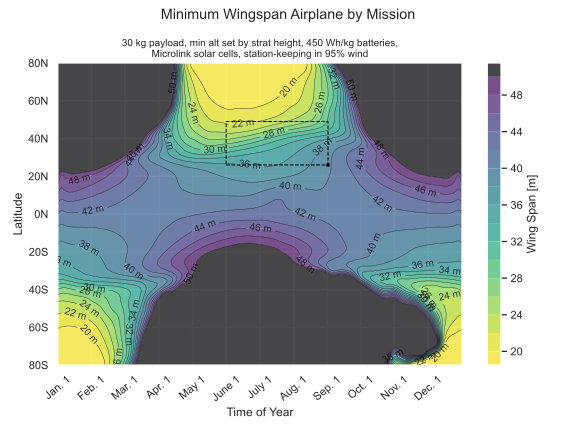

# Dawn Design Tool
by Peter Sharpe and Annick Dewald

## Description

Automatic-differentiation-accelerated multidisciplinary design optimization for high-altitude long-endurance (HALE) aircraft.

Related publication: [An Optimization Approach to Mapping the Feasible Mission Space of a High-Altitude Long-Endurance Solar Aircraft](docs/AIAA%20Solar%20Airplane%20Paper.pdf)

For more documentation, see [the memo in this repository](docs/memo.pdf).

Example feasibility chart outputs:



## Installation

There are several easy ways to get started with Design_Opt_HALE! (Assuming you already have Python >=3.7 installed, preferably via the [Anaconda distribution](https://www.anaconda.com/distribution/#download-section) - if not, do this first.)

### The Poetry Way (managed virtual environment)
This is the easiest way to guarantee a correct install environment.
It also guarantees that your environment will be isolated from your system environment, helping to guarantee behavior matches expectations.
Assuming you have Python >= 3.7, go to [here](https://python-poetry.org/docs/) and follow the `curl` or `Invoke-WebRequest` install directions.
Then all you need to do is run
```bash
poetry install
```
to initialize the virtual environment inside of the repository.
To drop into the virtual environment, invoke
```bash
poetry shell
```
or call
```bash
poetry run <command_in_venv>
# e.g.
poetry run python design_opt.py
```

When you pull the repository, run `poetry install` to load any updated dependencies from the lock file.
This will keep you in sync with your colleagues.
To learn more about Poetry, including how to specify new dependencies or update dependencies, [read its docs](https://python-poetry.org/docs/)


### Legacy Installation (whole system environment)

1. First, you need to install [AeroSandbox](https://github.com/peterdsharpe/AeroSandbox/), an open-source Python package I started last year for automatic-differentiation-accelerated multidisciplinary design optimization for aircraft.
    * You can do this by opening up Command Prompt on Windows or Terminal on Mac/Linux and entering `pip install aerosandbox`. 
    * Windows users: if you get any permissions issues, run `cmd.exe` as administrator and try again. 
    * Mac/Linux users: if you get any permissions issues, type `sudo pip install aerosandbox` and proceed to run with administrator access.
2.  Next, you need to clone this repository (`Design_Opt_HALE`). 
    * Users who are familiar with Git: the clone target is `git@github.com:peterdsharpe/DawnDesignTool.git` if you're using SSH or `https://github.com/peterdsharpe/DawnDesignTool.git` if you're using HTTPS.
    * Users who are new to Git: I think the easiest interface to Git for most new users is GitHub Desktop. [Here](https://www.youtube.com/watch?v=77W2JSL7-r8) is a good introduction video (15 mins). Once you've watched that, congratulations! You now fall into the "familiar with Git" category above and can use the instructions in the previous bullet. Aren't recursive README instructions great?
    * Users who are new to Git and don't want to use Git: Just download a local copy of the current repository from [here](https://github.com/peterdsharpe/DawnDesignTool/archive/refs/heads/master.zip). Beware that this copy will not stay up-to-date with future improvements, so this may quickly become outdated!
3. Congratulations! If you've gotten here, you've successfully installed `DawnDesignTool`. 
    * To test it out, try running `DawnDesignTool/design_opt.py` in your favorite Python IDE. If you don't have a Python IDE, I'd humbly recommend PyCharm, but this is a matter of personal taste. You can also run it from command line with `python <path_to_directory>/DawnDesignTool/design_opt.py` or similar.

If you run into issues at any point, follow the troubleshooting steps in the eponymous section below.

## Usage

All the code that you care about is in one file: `design_opt.py`. It's nicely sectioned off into the following sections, denoted with the comment format `# region SectionName`:

* Setup
* Trajectory Optimization Variables
* Design Optimization Variables
* Atmosphere
* Aerodynamics
* Propulsion
* Solar Power Systems
* Gas Power Systems
* Weights
* Dynamics
* Finalize Optimization Problem
* Solve
    
If you're using the PyCharm IDE, you can instantly hop between these sections with the shortcut `ctrl + alt + .`.

In the first few dozen lines of `design_opt.py`, you'll see a bunch of flags that you can change. Feel free to play around with these flags and see how the design changes! (Beware, not all combinations of options work!)

If you want to do some kind of parameter sweep (e.g. how does the `span` of an optimized airplane change if I change `battery_specific_energy`), you can use `design_opt_sweep.py` as a template.

All of the other files in this repository are one-off experiments that I ran at someone's request and can be safely ignored (also, some of them are out of date). As you can probably tell, this isn't a clean, polished repository haha - nor is it meant to be, as we're rapid prototyping!
    
## Troubleshooting
Follow this decision tree:
* IF using_poetry == true THEN run `poetry install` inside of the repository directory
* ELSE try updating AeroSandbox by running this in your command line: `pip install --upgrade aerosandbox`
* For all other problems, notify Peter.
    
## Contact Info
If you run into issues, please use the following options, starting with the first and proceeding if I don't respond: DM me on the 16.82 Slack, open an issue ticket, email me at pds@mit.edu, send carrier pigeon.

## License

[MIT License, full terms here](LICENSE.txt).
